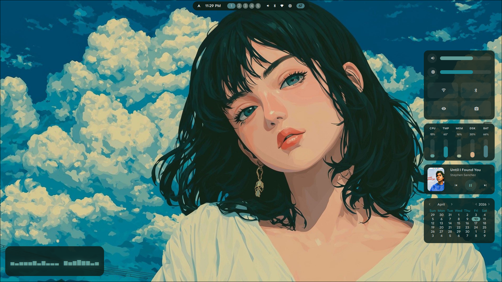
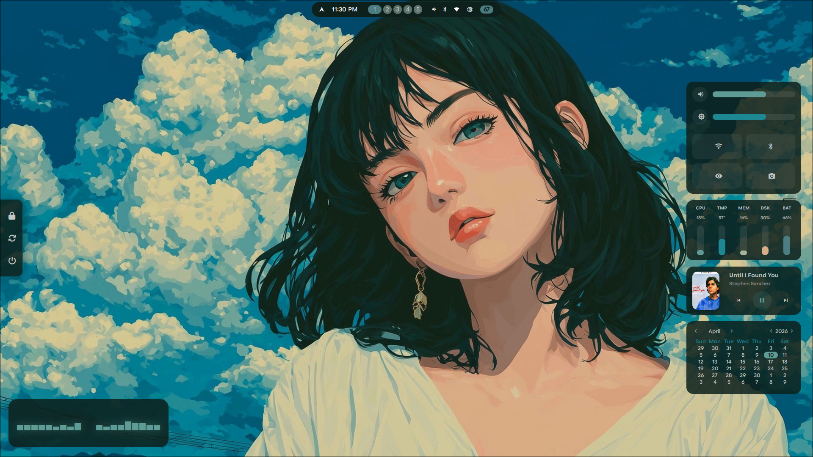
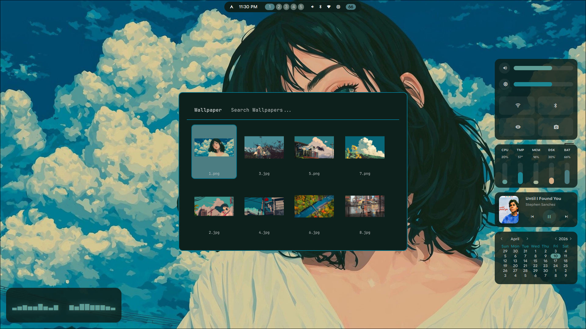
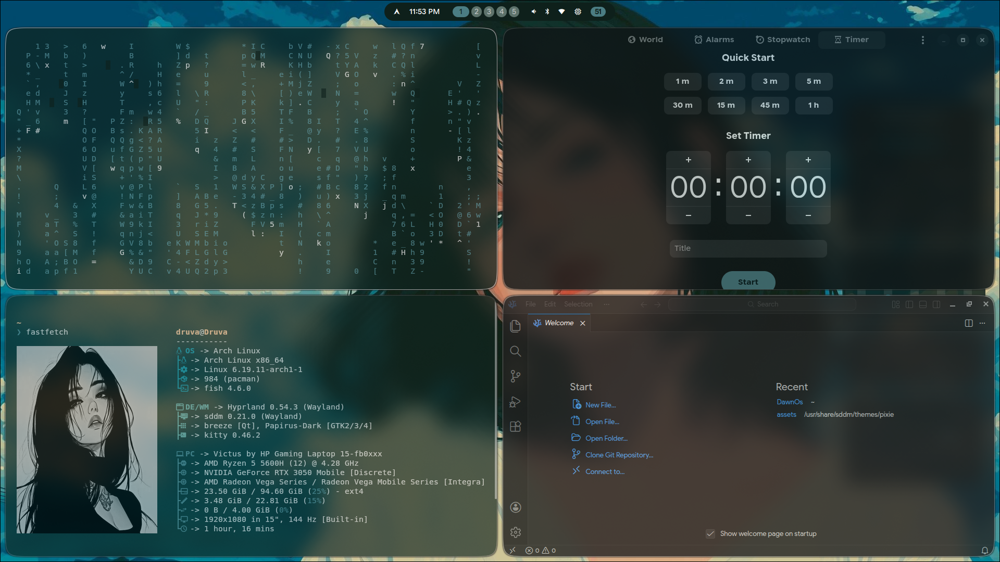

# 🌅 Dawn OS

> A complete, opinionated Arch Linux desktop experience built on Hyprland.  
> Clone it. Run one command. You're home.

---

## ✨ Preview






---

## 🚀 Quick Install

```bash
git clone https://github.com/druva-kiran/DawnOs.git
```
```bash
cd DawnOs
```
```bash
chmod +x install.sh
```
```bash
./install.sh
```

> **Note:** Do NOT run with sudo. The installer handles privilege escalation internally where needed.

The installer handles everything — packages, configs, backups, and a reboot prompt at the end.

---

## 🧠 What the Installer Does

- ✅ Detects which modules you have and only installs what's needed
- ✅ Prompts before installing anything — nothing runs silently
- ✅ Backs up your existing configs before touching them
- ✅ Installs `yay` automatically if no AUR helper is found
- ✅ Offers optional packages — you choose what you want
- ✅ Sets **fish** as your default shell automatically
- ✅ Asks to reboot at the end to apply all changes

---

## 🎨 Colors & Theming

Dawn OS uses a fully integrated theme pipeline — colors flow from a single source into GTK, Qt, and the shell.

### Color Pipeline

| Tool | Role |
|---|---|
| **Matugen** | Generates a full color palette from your wallpaper |
| **GTK 3 / GTK 4** | Applies theme to all GTK apps (Firefox, Nautilus, etc.) |
| **Qt5ct / Qt6ct** | Applies theme to Qt apps |
| **Kvantum** | Qt theme engine for deeper Qt styling |
| **Eww SCSS** | Widget colors sourced from the palette |
| **Waybar CSS** | Bar colors follow the same palette |

### How to Change the Color Theme

1. Set a new wallpaper using the wallpaper picker (`SUPER ALT + W`)
2. Matugen reads the wallpaper and generates a new palette automatically
3. GTK, Qt, Eww, and Waybar all update to match

### GTK Theme

- GTK 3 config → `DawnOS/gtk/gtk-3.0/`
- GTK 4 config → `DawnOS/gtk/gtk-4.0/`
- Managed via **nwg-look** (optional AUR package)

### Qt Theme

- Qt5 config → `DawnOS/qt/qt5ct/`
- Qt6 config → `DawnOS/qt/qt6ct/`
- Theme engine → `DawnOS/Kvantum/`
- Open **qt5ct** or **qt6ct** to switch Qt style manually

---

## ⌨️ Keybindings

> Full list lives in `DawnOS/hypr/hyprland.conf`.

### General

| Key | Action |
|---|---|
| `SUPER + Return` | Terminal |
| `SUPER + Space` | App launcher |
| `SUPER + F` | File manager |
| `SUPER + W` | Close window |
| `SUPER + V` | Toggle floating |
| `SUPER + L` | Lock screen |
| `SUPER + B` | Browser |

### Workspaces

| Key | Action |
|---|---|
| `SUPER + 1–9` | Switch workspace |
| `SUPER + SHIFT + 1–9` | Move window to workspace |
| `SUPER + Arrow Keys` | Move focus |
| `SUPER + Scroll` | Cycle workspaces |

### Apps & UI

| Key | Action |
|---|---|
| `SUPER + N` | Notification center |
| `SUPER ALT + S` | Sidebar |
| `SUPER ALT + Space` | Power menu |
| `SUPER ALT + W` | Wallpaper picker |
| `Print` | Screenshot → editor |

### Quick Launch (ALT + key)

| Key | App |
|---|---|
| `ALT + W` | WhatsApp |
| `ALT + D` | Discord |
| `ALT + M` | Gmail |
| `ALT + Y` | YouTube |
| `ALT + G` | GitHub |
| `ALT + S` | Spotify |

### Media Keys

| Key | Action |
|---|---|
| Volume keys | Raise / lower / mute |
| Brightness keys | Up / down |
| Media keys | Play / pause / next / prev |

---

## 📁 Project Structure

```text
DawnOs/
├── DawnOS/
│   ├── hypr/           # Hyprland config
│   ├── eww/            # Widget system (audio visualizer, sidebar, power menu)
│   ├── waybar/         # Status bar
│   ├── kitty/          # Terminal
│   ├── rofi/           # App launcher & wallpaper picker
│   ├── fish/           # Shell config with starship prompt
│   ├── nvim/           # Neovim config
│   ├── matugen/        # Color generation from wallpaper
│   ├── swaync/         # Notification center
│   ├── swayosd/        # Volume/brightness OSD
│   ├── fastfetch/      # System info
│   ├── gtk/            # GTK 3 & 4 theme
│   ├── qt/             # Qt5 & Qt6 theme
│   ├── Kvantum/        # Kvantum theme engine
│   ├── sources/        # Hyprland sourced configs (keybindings, animations, etc.)
│   ├── scripts/        # Utility scripts
│   ├── pixie-sddm/     # SDDM login screen theme
│   └── assets/
│       ├── screenshots/ # Preview images
│       ├── wallpapers/  # Wallpapers → ~/Wallpapers
│       └── webapps/     # Webapp .desktop entries (10 apps)
├── install.sh          # Main installer (run without sudo)
├── uninstall.sh        # Remove configs and restore backups
└── README.md
```

---

## 🗑️ Uninstall

Removes all symlinks and restores your original configs from backup.

```bash
./uninstall.sh
```

---

## 📋 Requirements

- Arch Linux
- `sudo` access
- Internet connection

---

## 📄 License

MIT — free to use, modify, and share.
